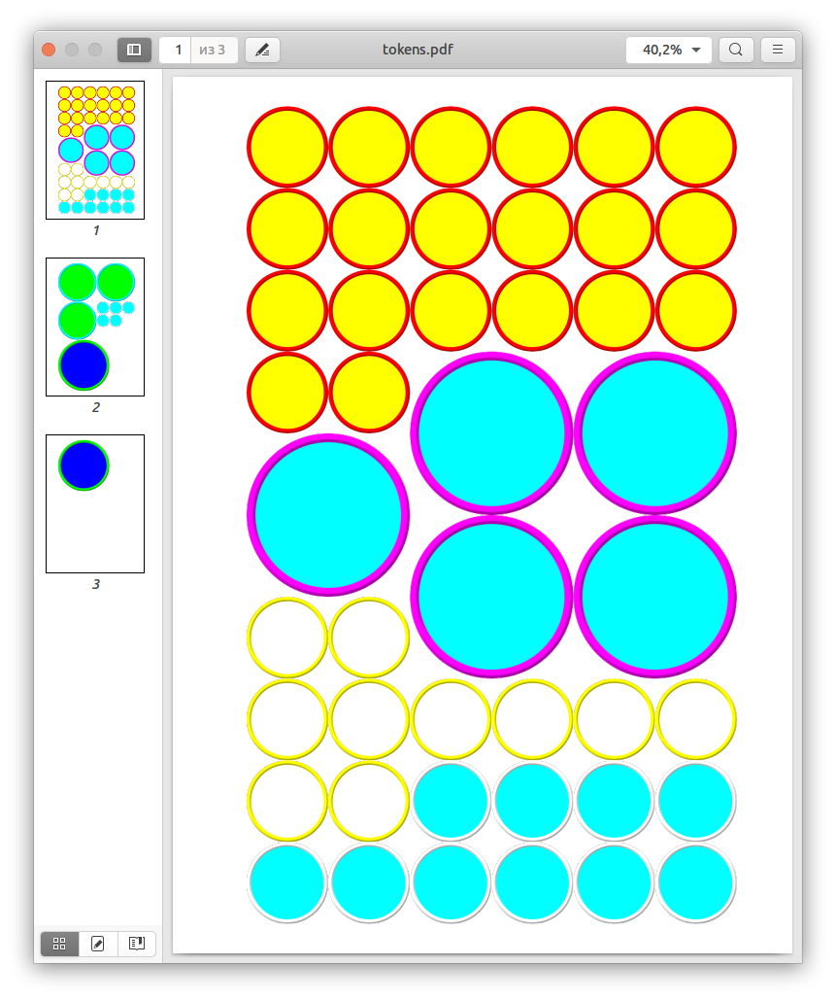

# rpg-tokens-layout
This script places tabletop RPG tokens on the list, which helps save time in preparing for printing.

## Instructions for use:
1. Create tokens (I personally use https://rolladvantage.com/tokenstamp/ for this) 
2. Put tokens in the `tokens` directory
3. Enter file names in `tokens.txt`. Format: `<filename>|<size>|<amount>`. You can use spaces for alignment and # for commenting. Example in [this file](
tokens.txt)
4. Run `make_list.py`

## Example

## Additional settings
You can change the following parameters for precise settings:
- PADDING_TOP
- PADDING_LEFT
- VERTICAL_CELLS
- HORIZONTAL_CELLS
- CELL_SIZE
- MAX_PAGES
- PAGE_UNITS - pt: point, mm: millimeter, cm: centimeter, in: inch
- PAGE_FORMAT - A3, A4, A5, Letter, Legal
- TOKENS_DIR
- TOKENS_LIST
- OUTPUT_FILE
